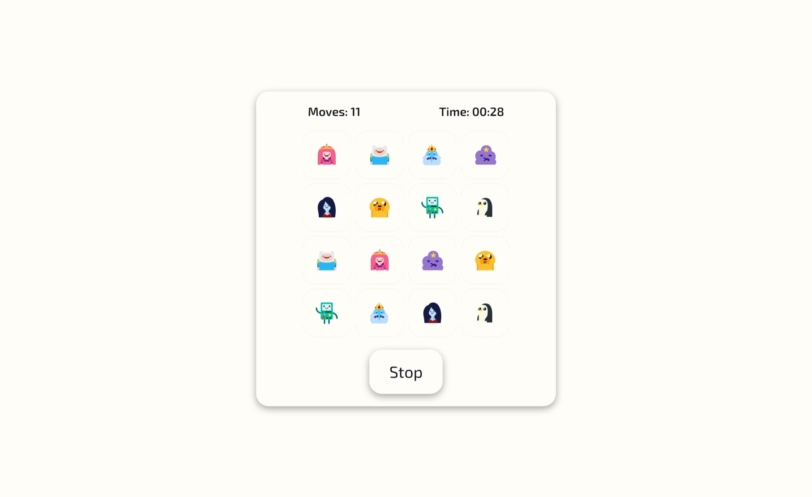

# Memoria version: 1.0.0 

This version includes some functionality:

- Game menu
- Score
- Visual effects

## Game menu

This menu includes two buttons to start and end the game.

## Score

Two values are displayed in the upper part of the playing field: the number of movements and the time of the current game.

## Visual effects

Nice card flip animation.

## Screenshot

